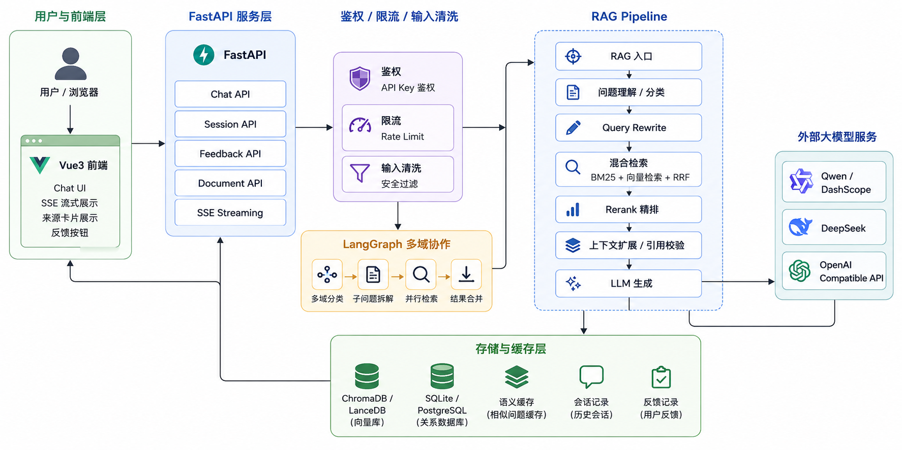

# lawyerAgents

面向中国法律场景的 RAG 智能咨询系统，基于 FastAPI、LangChain、LangGraph 和 Vue3 构建，支持法条问答、案情分析、诉讼时效计算、法律文书生成、多轮会话和 SSE 流式输出。



更详细的系统架构请查看：[docs/ARCHITECTURE.md](docs/ARCHITECTURE.md)。

## 核心能力

### RAG 检索增强

支持 BM25、向量检索、RRF 融合与 Rerank 精排。

支持法条上下文扩展、司法解释补充和引用来源返回。

回答中包含 `answer`、`sources`、`risk_warning`，降低无依据回答风险。

### 多 Agent 协作

基于 LangGraph 实现多域法律问题拆解。

单域问题走快速路径，多域问题自动拆解为子问题并行检索。

支持案情分析、诉讼时效计算和法律文书生成等扩展链路。

### 工程化能力

FastAPI + Vue3 前后端分离。

支持 SSE 流式输出，前端可展示生成过程和来源卡片。

支持多轮会话记忆、语义缓存、用户反馈和回答修正。

### 存储与部署

默认使用 SQLite，支持通过 `DATABASE_URL` 切换 PostgreSQL。

ChromaDB / LanceDB 用于向量与案例检索。

提供 `.env.example`、部署说明和架构文档，便于本地演示和后续生产化。

## RAG 核心流程

RAG 核心流程包括：问题分类、Query Rewrite、BM25 检索、向量检索、RRF 融合、Rerank 精排、上下文扩展、引用校验和 LLM 生成。

详细流程请查看：[docs/RAG_PIPELINE.md](docs/RAG_PIPELINE.md)。

## 快速启动

### 环境要求

- Python 3.10+
- Node.js 18+
- 可用的模型服务 Key，例如 Qwen / DashScope

### 安装后端依赖

```powershell
pip install -r requirements.txt
```

### 配置环境变量

```powershell
copy .env.example .env
```

编辑 `.env`，填入模型服务 Key。不要把真实 Key 提交到 GitHub。

### 启动后端

```powershell
python run.py
```

后端默认地址：

```text
http://localhost:9000
```

### 启动前端

```powershell
cd frontend
npm install
npm run dev
```

前端默认地址通常为：

```text
http://localhost:5173
```

## 配置

常用配置请参考 `.env.example`：

```env
LLM_PROVIDER=qwen
EMBEDDING_PROVIDER=qwen
QWEN_API_KEY=
QWEN_CHAT_MODEL=qwen3-max
QWEN_EMBEDDING_MODEL=text-embedding-v4
QWEN_RERANKER_MODEL=gte-rerank-v2
DATA_DIR=./data
CHROMA_PERSIST_DIR=./chroma_db
DATABASE_URL=
```

完整部署配置请查看：[docs/DEPLOYMENT.md](docs/DEPLOYMENT.md)。

## 项目结构

```text
lawyerAgents/
├── app/                  # FastAPI 后端与 RAG 核心逻辑
├── frontend/             # Vue3 前端
├── data/                 # 法律知识库与本地数据
├── scripts/              # 数据构建、案例导入等脚本
├── docs/                 # 架构、流程、部署与评测文档
├── run.py                # 后端启动入口
├── requirements.txt
└── README.md
```

## 技术栈

| 模块 | 技术 |
| --- | --- |
| 后端服务 | FastAPI、Pydantic |
| RAG 编排 | LangChain、LangGraph |
| 检索增强 | BM25、ChromaDB、LanceDB、RRF、Rerank |
| 模型接入 | Qwen / DashScope、DeepSeek、OpenAI Compatible |
| 数据存储 | SQLite、PostgreSQL |
| 前端 | Vue3、Vite、TailwindCSS |
| 流式输出 | SSE |

## 文档

- [系统架构说明](docs/ARCHITECTURE.md)
- [RAG Pipeline 设计](docs/RAG_PIPELINE.md)
- [RAG 评测说明](docs/EVALUATION.md)
- [部署说明](docs/DEPLOYMENT.md)

## Roadmap

- [x] 增加轻量 RAG 评测脚本与报告
- [x] 增加 Docker Compose 部署
- [x] 增加基础单元测试和 API 测试覆盖
- [ ] 增加 Java Spring Boot 网关层
- [ ] 增强 PDF / 表格 / 结构化文档解析能力
