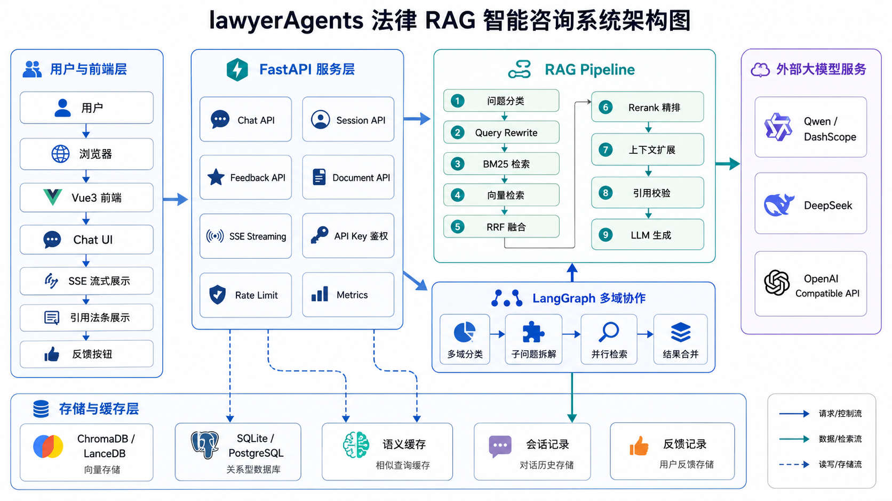
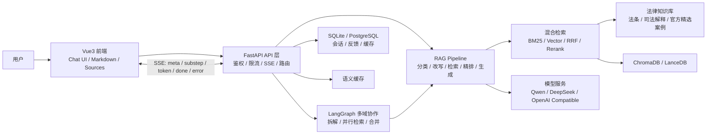

# 系统架构说明

lawyerAgents 是一个面向中国法律场景的 RAG 智能咨询系统。系统以 FastAPI 为服务入口，结合 LangChain、LangGraph、BM25、向量检索、Rerank、ChromaDB / LanceDB、SQLite / PostgreSQL、Vue3 和 SSE 流式输出，提供法条问答、案情分析、诉讼时效计算、法律文书生成、多轮会话和反馈管理能力。

## 1. 总体架构



图片版简化架构图用于 README 首页展示，完整架构图用于本文档说明。图片版架构图的生成提示词保存在 `docs/assets/architecture.prompt.md`。

## Mermaid 可编辑版本



## 2. 模块职责

### Vue3 前端

负责聊天界面、模式选择、SSE 流式展示、Markdown 渲染、引用法条卡片、参考案例展示、反馈入口以及劳动仲裁申请书预览等交互。

### FastAPI API 层

负责 HTTP / SSE 接口、请求校验、输入清洗、API Key 鉴权、限流、指标统计、会话读写和不同业务流程的路由分发。

### RAG Pipeline

负责法律咨询主流程编排，包括问题分类、Query Rewrite、混合检索、RRF 融合、Rerank 精排、上下文扩展、引用校验和 LLM 生成。

### LangGraph 多域协作

用于处理跨领域法律问题。系统可将复杂问题拆成多个领域子问题，并行检索后合并结果，避免只按单一领域回答导致遗漏。

### 混合检索模块

BM25 适合精确术语、罪名、法条编号和时效关键词；向量检索适合口语化和语义相近表达；RRF 融合用于减少单一路召回偏差，Rerank 用于控制最终上下文质量。

### 语义缓存

对重复或高度相似问题进行缓存命中，减少重复检索和模型调用。缓存命中包括精确 hash 命中和 embedding 相似命中。

### 会话与反馈存储

默认可使用 SQLite，本地演示部署简单；配置 `DATABASE_URL` 后可使用 PostgreSQL。存储内容包括会话记录、反馈记录、语义缓存等。

### 模型服务适配层

支持 Qwen / DashScope、DeepSeek、OpenAI Compatible 等模型服务。不同模型能力可用于主回答、摘要、Embedding、Rerank 等环节。

## 3. 请求链路

### 普通问答请求链路

```text
用户
  -> Vue3 前端
  -> FastAPI
  -> 输入清洗 / 鉴权 / 限流
  -> RAG Pipeline
  -> BM25 + 向量检索
  -> RRF 融合 + Rerank
  -> 上下文扩展 + 引用校验
  -> LLM 生成
  -> 返回 answer + sources + risk_warning
```

### SSE 流式请求链路

```text
用户
  -> Vue3 前端
  -> FastAPI Streaming API
  -> event: meta
  -> event: substep
  -> event: token
  -> event: done
  -> event: error
```

其中：

- `meta`：领域、缓存命中、多域标记等元信息。
- `substep`：分类、检索、精排、扩展、生成等阶段进度。
- `token`：模型生成内容。
- `done`：最终 sources、risk_warning、timings、record_id。
- `error`：错误信息。

## 4. 数据流

### 法律文档进入向量库

本地法律文档放在 `data/` 下，经文档加载、文本切分、条号提取后构建向量索引，并保存到 ChromaDB / LanceDB。司法解释和官方精选案例可以使用独立索引或独立数据结构按需检索，避免启动时全量读取过大数据。

### 用户问题进入 RAG Pipeline

用户问题先经过输入清洗、意图识别和领域分类。单域问题进入快速路径，多域问题进入 LangGraph 多域协作流程。

### 检索结果进入 LLM 上下文

BM25 和向量检索结果经 RRF 融合和 Rerank 精排后，系统补充相邻法条、款项上下文和必要司法解释，再拼装为 LLM 上下文。

### 回答、引用、反馈持久化

回答生成后，系统返回 Markdown `answer`、`sources`、`risk_warning`、`case_results` 等结构化结果。会话记录、用户反馈和语义缓存写入 SQLite 或 PostgreSQL，便于后续追踪和优化。

## 5. 后续 Java 网关层规划

Java Spring Boot 网关层属于 Roadmap，当前不是已完成能力。未来可在 Python RAG 服务前增加 Java 网关，负责：

- 用户认证
- 权限管理
- 会话管理
- 问答记录主库
- SSE 转发
- 审计日志
- 企业系统集成

这种设计适合将 Python RAG 能力作为 AI 服务层，Java 负责企业级业务集成、权限和审计。
