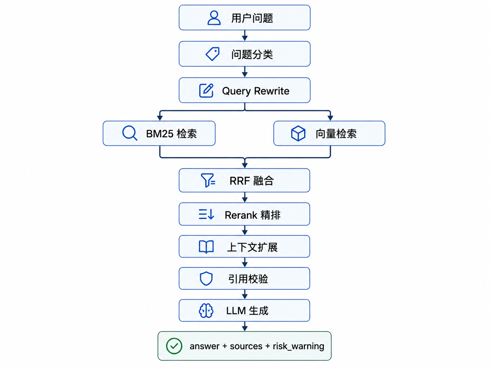
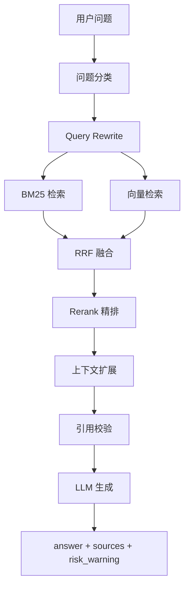

# RAG Pipeline 设计说明

本文说明 lawyerAgents 法律咨询主流程中的 RAG Pipeline。系统目标不是让模型自由回答，而是尽量让回答建立在可追踪的法条、司法解释和参考案例之上。

## 流程图

## Mermaid 可编辑版本

## 1. 问题分类

用户输入后，系统先判断问题意图和法律领域：

- 单域问题走快速路径，例如劳动、婚姻、合同、刑事等。
- 多域问题进入 LangGraph 多域协作，拆成多个子问题并行检索。
- 分类结果会影响检索范围、法条库选择、参考案例过滤和前端领域标签。

分类阶段需要尽量避免把跨领域问题压成单一领域。例如“公司高管挪用员工工资款”可能同时涉及劳动维权和刑事责任。

## 2. Query Rewrite

多轮会话中，用户经常使用省略表达，例如“那我还能赔多少？”“这个能起诉吗？”。Query Rewrite 的目标是把追问改写成独立问题。

原则：

- 只补全上下文，不生成答案。
- 保留用户真实问题，不额外添加事实。
- 避免历史回答污染当前问题。
- 对案情状态可以做必要摘要，但不能替用户编造证据或事实。

## 3. 混合检索

系统使用 BM25 和向量检索两路召回：

- BM25 适合精确法律术语、法条编号、罪名、时效、机构名称等关键词。
- 向量检索适合口语化、语义相近、用户表达不精确的问题。
- 两路召回互补，避免只靠关键词或只靠向量带来的召回偏差。

## 4. RRF 融合

RRF 用于融合 BM25 和向量检索结果。它基于排序名次而不是原始分数，因此不需要强行比较 BM25 分数和向量相似度。

作用：

- 将两路召回结果合并。
- 降低单一路召回偏差。
- 为 Rerank 提供更高质量的候选集。

## 5. Rerank 精排

Rerank 对融合后的候选结果进行相关性重排，控制最终进入 LLM 上下文的文档数量。

收益：

- 降低噪声上下文带来的幻觉风险。
- 减少无关法条进入 prompt。
- 控制 token 成本和响应延迟。

简单短问题可配置跳过 Rerank，以换取更低延迟。

## 6. 上下文扩展

法律条文往往存在前后条、款项、定义条、例外条之间的关系。只截取孤立片段容易导致理解错误。

系统支持：

- 法条前后条扩展。
- 款项、条文上下文补全。
- 被引用条文附近内容补充。
- 司法解释按需补充。

司法解释不随主法条库全量加载，而是通过独立检索机制在需要时补充。

## 7. 引用校验

回答需要返回 `sources`，并尽量保证正文引用和 `sources` 一致。

要求：

- `sources` 返回法条来源、法名、条号和片段。
- `confidence` 可用于标注引用可信度。
- 检索不到明确依据时，应提示不确定或建议补充材料。
- 避免编造法律名称、条号和条文内容。

法律 RAG 的关键不是引用越多越好，而是引用必须真实、相关、可追踪。

## 8. LLM 生成

LLM 生成阶段要求模型基于检索上下文回答，不应凭空扩展事实。

普通法律咨询回答结构通常包含：

- 初步判定
- 法律依据与分析
- 实务建议与风险提示
- 免责声明

后端同时输出 `risk_warning`，用于提示证据不足、事实缺失、时效风险、地区裁判口径差异等问题。

## 9. SSE 流式输出

系统通过 SSE 让前端实时展示生成过程。常见事件包括：

- `meta`：领域、是否缓存命中、多域标记。
- `substep`：pipeline 阶段进度，例如分类、检索、精排、扩展、生成。
- `token`：模型生成内容。
- `done`：sources、risk_warning、timings、record_id。
- `error`：错误信息。

SSE 设计便于演示，也便于用户感知长回答生成过程。

## 10. 性能优化点

- 语义缓存：重复或相似问题优先命中缓存。
- Rerank top_k 控制：减少进入 LLM 的无关上下文。
- 多域并行检索：跨领域问题可并行召回再合并。
- 轻量模型用于分类和摘要：降低主模型调用成本。
- SSE 降级策略：长耗时任务仍可通过 substep / keepalive 保持前端连接可感知。
